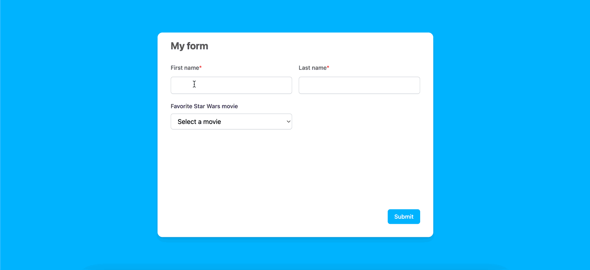

# Code Example - Responsive Form 

A code example showcasing a responsive form that adapts to both **mobile** and **desktop** interfaces. The code demonstrates proficiency in **handling form state**, **validation**, and **data fetching** using modern React practices and libraries.

## Web vs Mobile View

## Features
 ### 1. Responsive Design 
 - Adapting seamlessly to both mobile and desktop screen sizes.

 ### 2. Form Library
- Formik is used to manage the form state and handle user inputs.

### 3. Validation
- Yup is used to validate the first and last name fields 
- Error messages are displayed for validation errors.

### 4. Data Fetching
- Data for the "Favorite Star Wars Movie" field is retrieved from a GraphQL API.
- Apollo is used for fetching and managing the data.
### 5. Separation of Concerns
- There is a clear separation between the logic for the form and the data query from the visual components.
- Best practices for code structuring are adopted.
Additional Considerations

## Technologies Used
#### `React`
#### `Formik` for state and user input managing 
#### `Yup` for validation
#### `Apollo` for data fetching

## Usage

### - Clone the repository.
### - Install dependencies using `npm install` or `yarn`.
### - Run the application using `npm start` or `yarn start`.
### - Open [http://localhost:3000](http://localhost:3000) to view it in the browser.

